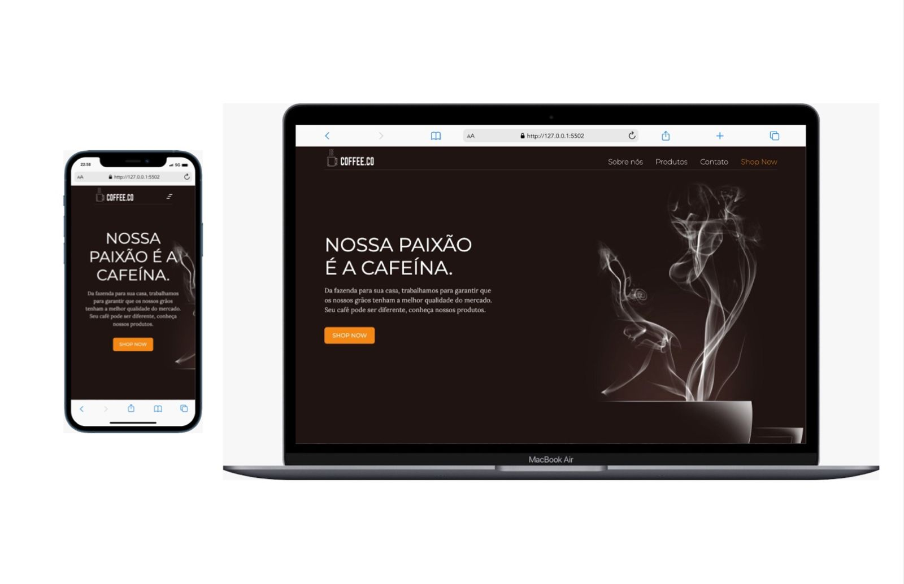
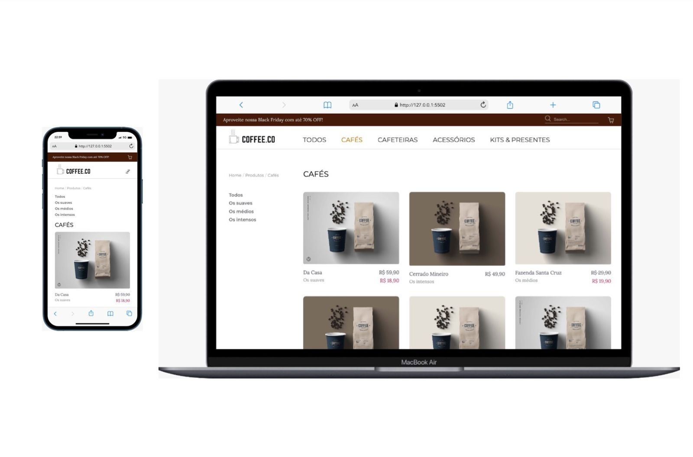
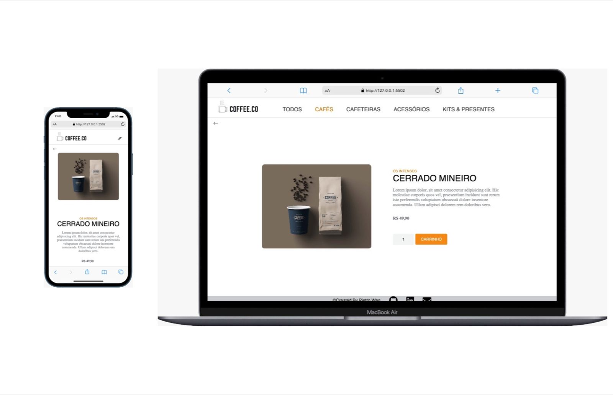
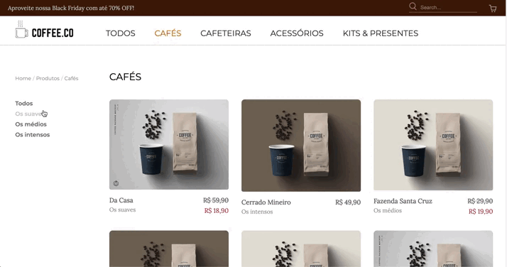

# CoffeCo

Feito com ♥ by [Pietro Weg](www.linkedin/com/pwsera)  

Acesse o projeto [AQUI!](https://pwsera.github.io/ecommerce-coffeeco-layout/)

---

<!---Esses são exemplos. Veja https://shields.io para outras pessoas ou para personalizar este conjunto de escudos. Você pode querer incluir dependências, status do projeto e informações de licença aqui--->

  
   
  
   
  

> Esse projeto foi construído durante a Semana 3 do Gama Experience #40. O Desafio principal tinha por objetivo construir um e-commerce utilizando apenas CSS e HTML (puros).

## 💻 Tecnologias Utilizads

Durante o projeto, foram utilizadas as seguintes tecnologias: 
 - [CSS](https://www.w3.org/Style/CSS/)
 - [HTML](https://developer.mozilla.org/pt-BR/docs/Web/HTML)
 - [CSS.gg](https://css.gg/)
 - [Font Awesome](https://fontawesome.com/)

## ☕ Filtro

A filtragem se encontra na página dos produtos, e foi construída puramente com HTML e CSS com o auxílio dos [General sibling combinator](https://developer.mozilla.org/en-US/docs/Web/CSS/General_sibling_combinator):

  

## 📝 Licença

Esse projeto está sob licença. Veja o arquivo [LICENÇA](license.md) para mais detalhes.

[⬆ Voltar ao topo](#CoffeCo) 